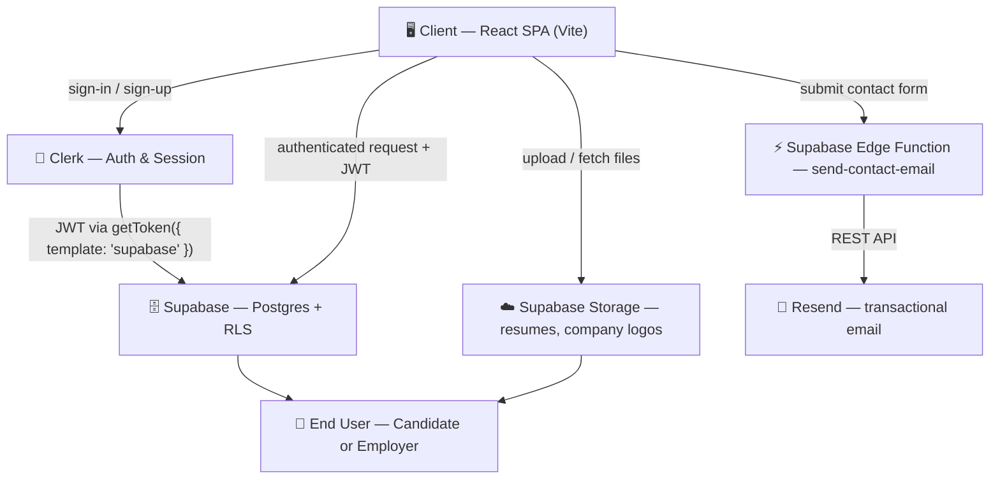
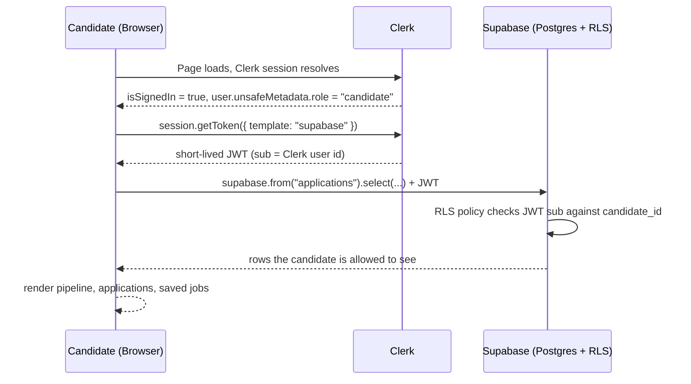
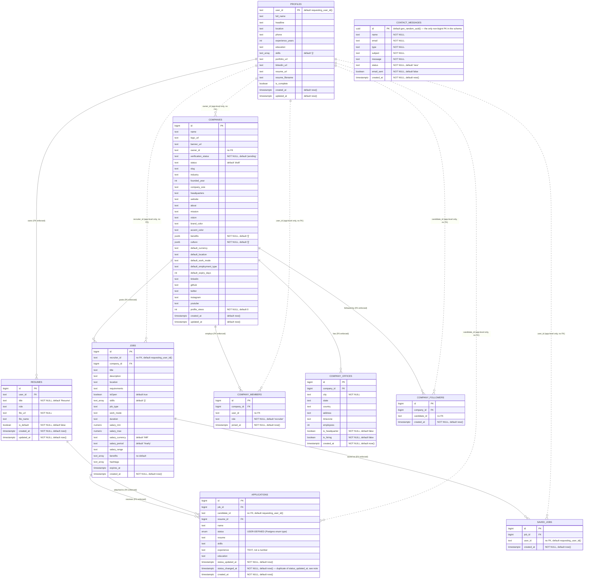
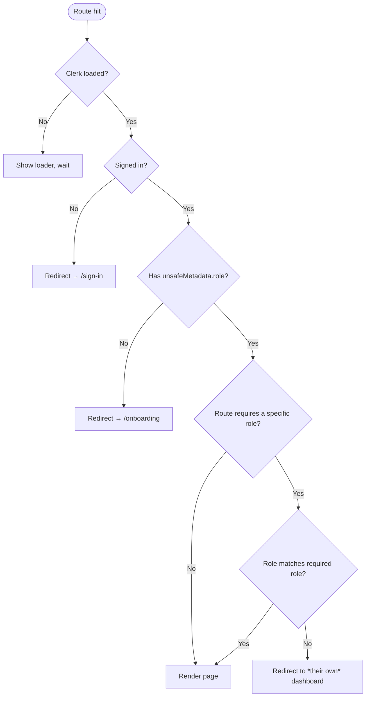
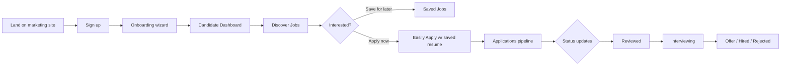
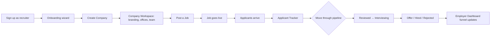
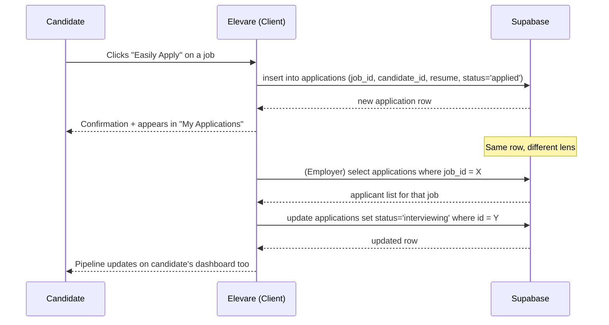

<div align="center">


# Elevare

**The hiring platform that gets out of the way.**

A full-stack job platform connecting candidates and employers — one clean codebase, two purpose-built experiences.

[🚀 Live Demo](https://elevare-beta.vercel.app/) · [📦 Repository](https://github.com/Algode18/elevare) · [📖 Documentation](https://github.com/Algode18/elevare#readme)

</div>

<br />

> [!NOTE]
> This README is the single source of truth for the project. It documents what is actually implemented today — not an aspirational spec. Sections describing planned work are clearly labeled under [Future Roadmap](#️-future-roadmap).

## 📚 Table of Contents

<details>
<summary><strong>Click to expand</strong></summary>

- [About Elevare](#-about-elevare)
- [Features Overview](#-features-overview)
- [Project Highlights](#-project-highlights)
- [Tech Stack](#-tech-stack)
- [Architecture](#️-architecture)
- [Folder Structure](#-folder-structure)
- [Database Design](#️-database-design)
- [Authentication Flow](#-authentication-flow)
- [Project Workflow](#-project-workflow)
- [Installation](#-installation)
- [Environment Variables](#-environment-variables)
- [Data Layer (API Overview)](#-data-layer-api-overview)
- [UI Components](#-ui-components)
- [Performance Optimizations](#-performance-optimizations)
- [Security](#️-security)
- [Responsive Design](#-responsive-design)
- [Accessibility](#-accessibility)
- [Deployment](#-deployment)
- [Future Roadmap](#️-future-roadmap)
- [Challenges Faced](#-challenges-faced)
- [Lessons Learned](#-lessons-learned)
- [Contributing](#-contributing)
- [License](#-license)
- [Author](#-author)
- [Support](#-support)
- [Acknowledgements](#-acknowledgements)
- [Project Statistics](#-project-statistics)

</details>

## 🧭 About Elevare

Elevare (Latin — "to lift up, to raise") is a full-stack hiring platform built as a single React application with two distinct experiences layered on top of shared infrastructure: a candidate job-search product and an employer hiring workspace.

**What is Elevare?**

It's a place where a candidate can build a profile once, discover roles that match it, apply in one click, and track every application through a real pipeline — and where a company can post a role, review applicants, and manage their public presence, without duct-taping together a spreadsheet, an inbox, and a job board listing.

**Why was it built?**

Most student/portfolio job-board clones stop at "list some jobs, apply to them." Elevare was built to go further — to actually model the two sides of hiring as first-class products with their own layouts, navigation, permissions, and data shape, backed by a real auth provider and a real Postgres database with row-level security, not mock JSON.

**What problem does it solve?**

Hiring is fragmented by default: candidates lose track of what they've applied to, and employers lose track of who applied and where each person is in the process. Elevare gives both sides one shared source of truth — the same `applications` row drives the candidate's "Applications" page and the employer's "Applicants" page.

**Who is it built for?**

| Audience | What they get |
|---|---|
| 🎯 Candidates | A discovery-first job search, saved jobs, one-click applications, and a pipeline view of every application |
| 🏢 Employers | A dashboard, job posting/management, applicant tracking, and a full Company Workspace (branding, offices, team) |
| 🧑‍💼 Recruiters | The same employer tooling, scoped to the companies they're a member of |
| 🎓 Students / developers | A reference implementation of Clerk + Supabase (RLS, Storage, Edge Functions) wired into a real multi-role React app |

**The vision**

Elevare isn't trying to be a 200-feature ATS. The bet is that a hiring product that's fast, well-designed, and honest about state (empty states, loading states, error states — all handled, not an afterthought) beats one that's feature-heavy but rough around the edges. Every screen was built with a light theme ("Frosted Ivory") and a dark theme ("Midnight Nebula") as first-class citizens from day one, not bolted on later.

## ✨ Features Overview

### 👤 Candidate Features

| Feature | Description |
|---|---|
| 🧙 Onboarding Wizard | Multi-step flow that builds a structured candidate profile (headline, experience, education, skills, location) before they hit the dashboard |
| 🔍 Job Discovery | Search + filter by location, job type, and work mode, with an "AI Discover"-style hero surfacing matches |
| ⚡ Easily Apply | One-click apply using the candidate's saved resume — no re-uploading per job |
| 📌 Saved Jobs | Bookmark roles to revisit later, decoupled from the application itself |
| 📊 Application Pipeline | Visual tracking through Applied → In Review → Interview → Offer/Hired/Rejected |
| 📄 Resume Management | Upload, replace, and set a default resume, stored in Supabase Storage |
| ⚙️ Account Settings | Manage profile details and preferences post-onboarding |

### 🏢 Employer Features

| Feature | Description |
|---|---|
| 📈 Employer Dashboard | Hiring funnel + KPIs across all of the company's open roles |
| 📝 Job Posting & Management | Create, edit, open/close, and expire job listings |
| 🗂️ Applicant Tracking | Per-job applicant list with status transitions |
| 🏬 Company Workspace | Tabbed workspace for branding, offices, team members, and hiring/social presence |
| 👥 Team Membership | Multiple recruiters can belong to one company via `company_members` |

### ⚙️ Platform Features

| Feature | Description |
|---|---|
| 🔐 Authentication | Clerk-powered sign-in/up, session management, and role-based access (candidate vs. recruiter) |
| 🗄️ Database | Supabase Postgres with Row Level Security, scoped by the authenticated user |
| 🚀 Performance | Lean component structure, memoized derived state, and request-race protection on every fetch (see [Performance](#-performance-optimizations)) |
| 🛡️ Security | RLS-first data access, environment-scoped secrets, sanitized search input (see [Security](#️-security)) |
| 📱 Responsive Design | Every page is built mobile-first with `sm:`/`md:`/`lg:`/`xl:` breakpoints — not just "shrunk down" |
| 🌗 Dual Theme | Light ("Frosted Ivory") and dark ("Midnight Nebula") themes with no first-paint flash |

## 🏆 Project Highlights

> [!TIP]
> These are the pieces of Elevare most worth actually clicking through in the live demo.

- 🔍 **Job Discovery** — search + multi-filter discovery with a dedicated "AI Discover" hero component
- 📊 **Application Tracking** — a real pipeline, not just a status column — Applied → Reviewed → Interviewing → Offer/Hired/Rejected, visualized on both the candidate and employer sides
- 📄 **Resume Management** — resumes live in Supabase Storage, one-to-one with the profile, with re-upload-safe overwrite handling
- 🏢 **Employer Dashboard** — funnel + KPIs computed from the same applications data candidates see on their own dashboard
- 🏬 **Company Workspace** — a genuinely multi-tab company management surface (branding, offices, team, analytics), not a single settings form
- 📌 **Saved Jobs** — bookmarking is decoupled from applying, backed by its own `saved_jobs` table
- 🔐 **Authentication** — Clerk handles identity; a Clerk→Supabase JWT bridge (`getToken({ template: "supabase" })`) lets Postgres RLS trust the same session natively — no custom auth server
- 🧭 **Role-Based Access** — `ProtectedRoute` gates every authenticated route, and a signed-in candidate who lands on an employer URL is redirected to their dashboard instead of seeing a broken screen
- ☁️ **Cloud Storage** — resumes and company logos both live in Supabase Storage buckets, served over public URLs
- 🎨 **Modern UI** — Radix/shadcn primitives, Framer Motion micro-interactions, and a fully token-driven design system (see [Architecture](#️-architecture))

## 🧱 Tech Stack

### Frontend

| Tool | Purpose |
|---|---|
| React 19 | UI library |
| React Router 6 | Client-side routing (data router, nested layouts) |
| Vite | Dev server + build tool |
| Framer Motion | Animation / micro-interactions |

### Backend / Platform

| Tool | Purpose |
|---|---|
| Supabase | Postgres database, Row Level Security, Storage, Edge Functions — used as the application's entire backend |
| Supabase Edge Functions (Deno) | Serverless function for transactional contact-form email |
| Resend | Transactional email delivery, called from the Edge Function |

> [!NOTE]
> Elevare does not run a separate Node/Express API server. The client talks to Supabase directly through `@supabase/supabase-js`, with Postgres Row Level Security enforcing what each authenticated user can read or write. See [Data Layer](#-data-layer-api-overview) for how this is organized.

### Database

| Tool | Purpose |
|---|---|
| PostgreSQL (via Supabase) | Primary relational database |
| Row Level Security (RLS) | Per-row access control, scoped to the authenticated Clerk user |

### Authentication

| Tool | Purpose |
|---|---|
| Clerk (`@clerk/react`) | Sign-in/up, session management, user metadata (role) |
| Clerk ↔ Supabase JWT bridge | `session.getToken({ template: "supabase" })` issues a JWT Supabase RLS trusts natively |

### Storage

| Tool | Purpose |
|---|---|
| Supabase Storage | Resume files (`resumes` bucket), company logos (`company-logo` bucket), company banners (`company-banner` bucket) |

### Validation & Forms

| Tool | Purpose |
|---|---|
| React Hook Form | Form state management |
| Zod | Schema validation |
| `@hookform/resolvers` | Wires Zod schemas into React Hook Form |

### UI Library & Icons

| Tool | Purpose |
|---|---|
| Tailwind CSS v4 | Utility-first styling, driven entirely by CSS custom properties |
| Radix UI / shadcn | Accessible, unstyled component primitives |
| Lucide React | Icon set |
| Embla Carousel | Carousels (with autoplay) |
| Vaul | Drawer component |
| `@uiw/react-md-editor` | Markdown editor for job descriptions |

### Utilities

| Tool | Purpose |
|---|---|
| `class-variance-authority` + `clsx` + `tailwind-merge` | Composable, conflict-free className handling |
| `country-state-city` | Location pickers (job location, company offices) |
| `react-spinners` | Loading indicators |

### State Management

Elevare intentionally has no global state library (no Redux/Zustand/Jotai). State is handled with:

- React's built-in `useState` / `useContext` (theme, auth via Clerk's provider)
- A shared `useFetch` hook that wraps every Supabase call with loading/error/data state and race-condition protection

### Package Manager & Bundler

| Tool | Purpose |
|---|---|
| npm | Package management (`package-lock.json` committed) |
| Vite (Rolldown-powered, v8) | Bundler |
| ESLint 10 | Linting |

### Deployment

| Tool | Purpose |
|---|---|
| Vercel | Static hosting + SPA rewrites for the frontend |
| Supabase Cloud | Hosted Postgres, Storage, and Edge Functions |

## 🏗️ Architecture

Elevare follows a Backend-as-a-Service (BaaS) architecture — there is no custom application server between the client and the data layer. Clerk owns identity, Supabase owns data and files, and Postgres RLS is the actual authorization boundary.



**Why this shape?**

- **No custom backend to maintain** — auth, database, and file storage are each a managed service with their own scaling and security model.
- **RLS as the real authorization layer** — even if a client-side check were ever wrong or bypassed, Postgres itself refuses the query if the row doesn't belong to the requesting user.
- **One Edge Function, used sparingly** — server-side code exists only where it has to (sending email with a private API key), not as a general-purpose API layer.

**Request flow (a candidate loading their dashboard)**



## 📁 Folder Structure

```
elevare/
├── public/                          # Static assets served as-is
│   ├── companies/                    # Featured company logos (svg/png/webp)
│   ├── favicon.svg
│   ├── icons.svg
│   ├── logo.png / logo-dark.png
│   └── banner.jpeg
│
├── src/
│   ├── api/                          # Supabase query functions — the "data layer" (see below)
│   │   ├── apiJobs.js                  # Job CRUD, search/filter, save/unsave
│   │   ├── apiApplications.js          # Apply, list, withdraw applications
│   │   ├── apiCompanies.js             # Company CRUD, logo upload, membership, offices, followers, analytics
│   │   ├── apiResumes.js               # Resume library — upload, rename, set default, delete, usage stats
│   │   ├── apiProfiles.js              # Candidate profile get/upsert, profile resume upload
│   │   └── apiContact.js               # Contact form submission
│   │
│   ├── components/                   # Shared UI components
│   │   ├── ui/                          # shadcn/Radix primitives — button, input, select, drawer, dialog, ...
│   │   ├── companies/                   # Company cards, featured company UI
│   │   ├── discover/                    # AI-style discovery hero, job tiles/rows, filters, details panel
│   │   ├── elevare/                     # Branded app-shell chrome
│   │   ├── saved/                       # Saved-job card UI
│   │   ├── workspace/                   # Employer Company Workspace tabs (branding, offices, hiring & social, settings, analytics)
│   │   ├── header.jsx / site-header.jsx / site-footer.jsx
│   │   ├── protected-route.jsx          # Route guard — auth + onboarding + role checks
│   │   ├── theme-provider.jsx / theme-toggle.jsx
│   │   └── application-*.jsx            # Application card, pipeline card, journey drawer
│   │
│   ├── data/                         # Static JSON (featured companies list, FAQ content)
│   ├── hooks/                        # use-fetch, use-profile, use-saved-job-ids, use-resumes, ...
│   ├── layouts/                      # marketing-layout, app-layout, adaptive-companies-layout
│   ├── lib/                          # profile-completion %, dashboard copy, cn()/utils
│   │
│   ├── pages/                        # Route-level pages
│   │   ├── landing.jsx, jobs.jsx, job-details.jsx, companies.jsx, company-details.jsx
│   │   ├── about.jsx, contact.jsx, privacy.jsx, terms.jsx, not-found.jsx
│   │   ├── sign-in.jsx, sign-up.jsx, onboarding.jsx
│   │   ├── dashboard.jsx, discover-jobs.jsx, profile.jsx, resume.jsx,
│   │   │   applications.jsx, saved.jsx, settings.jsx
│   │   └── employer/
│   │       ├── dashboard.jsx, post-job.jsx, jobs.jsx
│   │       ├── applications.jsx, job-applicants.jsx
│   │       └── company.jsx, company-workspace.jsx
│   │
│   ├── utils/
│   │   └── supabase.js               # Single shared Supabase client + Clerk token bridge
│   │
│   ├── App.jsx                       # Router tree + Clerk + Theme provider wiring
│   ├── main.jsx                      # React root entry point
│   ├── App.css
│   └── index.css                     # Full design-token system (light + dark themes)
│
├── supabase/
│   └── functions/
│       └── send-contact-email/
│           └── index.ts              # Edge Function — emails support via Resend on contact submit
│
├── index.html                        # HTML shell + pre-hydration theme script (no flash-of-wrong-theme)
├── vercel.json                       # SPA rewrite rules
├── vite.config.js
├── eslint.config.js
├── components.json                   # shadcn component config
└── package.json
```

**What matters most in here**

| Path | Why it matters |
|---|---|
| `src/api/` | Every database interaction in the app funnels through these six files — no component talks to Supabase directly |
| `src/hooks/use-fetch.jsx` | The shared async wrapper every page uses instead of hand-rolled `useEffect` fetch logic |
| `src/components/protected-route.jsx` | The entire authorization boundary on the client side |
| `src/utils/supabase.js` | The one place the Supabase client is created; token is swapped per-request, not per-client |
| `src/index.css` | The whole visual identity of the app — both themes, every semantic color token, radii, shadows |
| `supabase/functions/send-contact-email` | The only server-side code in the project |

## 🗃️ Database Design

> [!NOTE]
> This section reflects the **live schema**, pulled directly from `information_schema.columns` and `information_schema.table_constraints` on the actual Supabase project — not inferred from application code. A few real columns and defaults differ from what the code alone would suggest (noted inline below).

### Entity-Relationship Overview



### Real foreign keys (verified against `information_schema.table_constraints`)

Only **8 foreign keys actually exist** in the live database. Every other "relationship" in the diagram above (candidate/recruiter/owner links back to `profiles`) is enforced only in application code and RLS policies, not by the database itself — because a Clerk user can exist and act (apply to a job, follow a company) before ever creating a `profiles` row, an actual FK there would block that.

| From | Column | To | Column |
|---|---|---|---|
| `jobs` | `company_id` | `companies` | `id` |
| `applications` | `job_id` | `jobs` | `id` |
| `applications` | `resume_id` | `resumes` | `id` |
| `saved_jobs` | `job_id` | `jobs` | `id` |
| `resumes` | `user_id` | `profiles` | `user_id` |
| `company_followers` | `company_id` | `companies` | `id` |
| `company_offices` | `company_id` | `companies` | `id` |
| `company_members` | `company_id` | `companies` | `id` |

**Not FK-enforced** (Clerk `user_id` text columns, matched at the application/RLS layer only): `companies.owner_id`, `jobs.recruiter_id`, `applications.candidate_id`, `saved_jobs.user_id`, `company_members.user_id`, `company_followers.candidate_id`.

### Table Reference

| Table | Purpose | Notes |
|---|---|---|
| `profiles` | One row per candidate, keyed on the Clerk `user_id` (default `requesting_user_id()`) | Has an `is_complete` flag not previously documented |
| `companies` | One row per employer company | Has a full listing-workflow layer beyond branding: `status` (`draft` by default), `slug`, and `benefits`/`culture` as **`jsonb`**, not arrays — different shape from `jobs.benefits`, which is a plain `text[]` |
| `jobs` | Job postings | `benefits`/`hashtags`/`skills` are `text[]`; `isOpen` has no `NOT NULL` in the live schema (defaults to `true` but is nullable) |
| `applications` | A candidate applying to a job | `status` is a real Postgres **enum type**, not `text`; `experience` is stored as `text`; there are two near-duplicate timestamp columns — `status_updated_at` and `status_changed_at` — both default to `now()`, worth consolidating |
| `saved_jobs` | Bookmarks, independent of applying | — |
| `resumes` | A candidate's resume library | The only table with a real FK back to `profiles` |
| `company_members` | Which users can manage which company | — |
| `company_offices` | Office locations per company | Has an `is_hiring` boolean alongside `is_headquarter` — not previously documented |
| `company_followers` | Candidates following a company | — |
| `contact_messages` | Public contact-form submissions | The only table with a **`uuid`** primary key (`gen_random_uuid()`) instead of `bigint identity`; also has `status` (`new` by default) and `email_sent`, tracking the Resend notification separately from the row itself |

> [!TIP]
> `applications.status` is the single field that drives the pipeline UI on both the candidate dashboard and the employer applicant tracker — one column, two views. Its values in the UI are `applied`, `reviewed`, `interviewing`, `offer`, `hired`, `rejected`.

## 🔐 Authentication Flow

Elevare uses Clerk for identity and session management, with a first-party Clerk↔Supabase integration so Postgres Row Level Security can trust the same session — no custom JWT signing, no separate auth server.

**How a role is assigned**

Role ("candidate" or "recruiter") is not a database column — it's stored on `user.unsafeMetadata.role` in Clerk, set during the `/onboarding` flow. Every protected route reads it from the live Clerk user object.

**ProtectedRoute logic (`src/components/protected-route.jsx`)**



This is why a signed-in candidate who navigates straight to `/employer/dashboard` (e.g. via a stray link) lands back on `/dashboard` instead of seeing a broken, empty employer view — and vice versa for a recruiter hitting a candidate-only route.

**Getting a Supabase-trusted JWT**

```js
// src/hooks/use-fetch.jsx (simplified)
const { session } = useSession();
const supabaseAccessToken = await session.getToken({ template: "supabase" });
const response = await cb(supabaseAccessToken, ...args);
```

That JWT is handed to Supabase via an `accessToken` callback on the shared client (`src/utils/supabase.js`), so every query automatically carries the current user's identity — and Postgres RLS policies (scoped by `auth.jwt()` / the Clerk `sub` claim) do the actual authorization.

**Session & protected routes at a glance**

| Concern | Handled by |
|---|---|
| Login / signup UI | Clerk (`<SignIn />` / `<SignUp />` via `sign-in.jsx` / `sign-up.jsx`) |
| Session persistence | Clerk (cookie-based, invisible to app code) |
| Client-side router integration | `routerPush` / `routerReplace` in `App.jsx`, so Clerk's internal navigation stays inside the SPA router instead of hard-reloading |
| "Is this request allowed?" | Postgres RLS, evaluated per-query using the JWT above |
| "Should this page even render?" | `ProtectedRoute`, evaluated per-route using Clerk's client-side user object |

## 🔄 Project Workflow

**Candidate Journey**



**Employer Journey**



**End-to-End Application Flow**



## 🚀 Installation

**Prerequisites**

- Node.js 18+
- npm
- A Clerk application (for auth)
- A Supabase project (for database + storage)

**1. Clone**

```bash
git clone https://github.com/Algode18/elevare.git
cd elevare
```

**2. Install dependencies**

```bash
npm install
```

**3. Configure environment variables**

Create a `.env` file in the project root — see the full table below:

```
VITE_CLERK_PUBLISHABLE_KEY=pk_test_xxxxxxxxxxxx
VITE_SUPABASE_URL=https://your-project-ref.supabase.co
VITE_SUPABASE_PUBLISHABLE_KEY=your-supabase-anon-key
```

**4. Run the dev server**

```bash
npm run dev
```

App runs at `http://localhost:5173`.

**5. Build for production**

```bash
npm run build
npm run preview   # optional — preview the production build locally
```

**6. Deploy**

See the full [Deployment](#-deployment) section — the project deploys to Vercel with zero extra config beyond environment variables.

## 🔑 Environment Variables

| Variable | Description | Required | Example |
|---|---|---|---|
| `VITE_CLERK_PUBLISHABLE_KEY` | Clerk publishable key — powers sign-in/up, session, and user metadata | ✅ | `pk_test_Y2xlcmsu...` |
| `VITE_SUPABASE_URL` | Your Supabase project's REST URL | ✅ | `https://abcxyzproj.supabase.co` |
| `VITE_SUPABASE_PUBLISHABLE_KEY` | Supabase anon/public key (safe for the client — access is enforced by RLS, not by keeping this secret) | ✅ | `eyJhbGciOiJIUzI1NiIsInR5cCI6IkpXVCJ9...` |

> [!WARNING]
> The app calls `throw new Error("Missing Publishable Key")` at startup if `VITE_CLERK_PUBLISHABLE_KEY` is missing — this is intentional, so a misconfigured deploy fails loudly instead of silently rendering a broken auth flow.

**Server-side secrets (Edge Function only — set via Supabase CLI, never in `.env`)**

| Secret | Description | Required |
|---|---|---|
| `RESEND_API_KEY` | Resend API key for sending the contact-form notification email | ✅ (for contact form) |
| `CONTACT_SUPPORT_EMAIL` | Inbox that receives contact-form submissions | ✅ |
| `CONTACT_FROM_EMAIL` | Verified sender address/domain in Resend | ✅ |

```bash
supabase functions deploy send-contact-email
supabase secrets set RESEND_API_KEY=re_xxxxxxxx
supabase secrets set CONTACT_SUPPORT_EMAIL=yoursupport.app@example.com
supabase secrets set CONTACT_FROM_EMAIL="Elevare <onboarding@resend.dev>"
```

## 🔌 Data Layer (API Overview)

> [!NOTE]
> Elevare has no custom REST/GraphQL API server — this section documents the client-side data layer (`src/api/*.js`) that every page calls through the shared `useFetch` hook, plus the one real server-side endpoint (the Edge Function).

**`apiJobs.js`**

| Function | Description |
|---|---|
| `getJobs(token, { location, company_id, searchQuery, job_type, work_mode })` | Search/filter open jobs, joined with company name/logo/verification |
| `getSingleJob(token, { job_id })` | Full job detail, joined with company profile + all applications |
| `getSavedJobs(token, ...)` / `getSavedJobIds(token)` | A candidate's saved jobs (full rows or lean id list) |
| `saveJob(token, { alreadySaved }, saveData)` | Toggle save/unsave on a job |
| `addNewJob(token, _, jobData)` | Create a job posting |
| `updateJob(token, { job_id }, jobData)` | Edit a job posting |
| `UpdateHiringStatus(token, { job_id }, isOpen)` | Open/close a job |
| `getMyJobs(token, { recruiter_id })` | A recruiter's own posted jobs, joined with applications |
| `deleteJob(token, { job_id })` | Delete a job posting |

**`apiApplications.js`**

| Function | Description |
|---|---|
| `applyToJob(token, _, applicationData)` | Submit an application (uploads a resume file directly) |
| `applyWithProfile(token, _, { job_id, candidate_id, name, profile, resume })` | "Easily Apply" using a saved profile + a picked Resume Library entry |
| `getApplications(token, { user_id })` | A candidate's applications, joined with job + company |
| `updateApplicationStatus(token, { job_id, id }, status)` | Move an applicant through the pipeline (employer side) |
| `withdrawApplication(token, { candidate_id }, applicationId)` | Candidate withdraws (deletes) an application |

**`apiCompanies.js`**

| Function | Description |
|---|---|
| `getCompanies(token)` | List all companies with open-job counts |
| `getCompanyById(token, { company_id })` | Single company detail |
| `getMyCompanies(token, { owner_id })` | Companies owned by the current user |
| `addNewCompany(token, _, companyData)` | Create a company (with logo upload) |
| `updateCompanyProfile(token, { company_id }, fields)` | Update branding/about/hiring-preference fields |
| `uploadCompanyAsset(token, _, { company_id, file, kind })` | Upload logo or banner to the matching Storage bucket |
| `deleteCompany` / `deleteOwnedCompanies` / `removeUserFromAllCompanies` | Cleanup on company or account deletion |
| `getCompanyOffices` / `addCompanyOffice` / `updateCompanyOffice` / `deleteCompanyOffice` | Office CRUD |
| `getCompanyMembers` / `addCompanyMember` / `updateCompanyMemberRole` / `removeCompanyMember` | Team membership CRUD |
| `followCompany` / `getCompanyFollowStatus` / `getCompanyFollowers` | Candidate follow/unfollow a company |
| `incrementCompanyProfileView(company_id)` | Fire-and-forget view counter via an `increment_company_profile_views` RPC |
| `getCompanyAnalytics(token, { company_id })` | Funnel + hiring-rate analytics computed from `jobs`/`applications`/`company_followers` |

**`apiResumes.js`** — a per-candidate resume library, separate from the single profile resume

| Function | Description |
|---|---|
| `getResumes(token, { user_id })` | List a candidate's uploaded resumes |
| `uploadResume(token, { user_id }, { file, title, role })` | Upload a new resume; first upload becomes default automatically |
| `renameResume` / `setDefaultResume` / `deleteResume` / `replaceResumeFile` / `duplicateResume` | Resume library management |
| `getResumeUsageStats(token, { user_id })` | Applications/interviews per resume, for the resume analytics view |

**`apiProfiles.js`**

| Function | Description |
|---|---|
| `getProfile(token, { user_id })` | Fetch the candidate profile (or `null` if not yet created) |
| `upsertProfile(token, _, profileData)` | Create/update profile in one upsert on `user_id` |
| `uploadProfileResume(token, { user_id }, file)` | Upload/replace the profile's 1:1 resume |

**`apiContact.js`**

| Function | Description |
|---|---|
| `submitContactMessage(_, _, contactData)` | Inserts into `contact_messages` (anon-insertable, write-only by design), then invokes the email Edge Function |

**Edge Function**

| Endpoint | Method | Description |
|---|---|---|
| `send-contact-email` | POST | Triggered after a `contact_messages` insert; emails the support inbox via Resend with the submitter's address set as `reply_to` |

## 🧩 UI Components

| Component | Role |
|---|---|
| `site-header.jsx` / `header.jsx` | Marketing vs. authenticated-app navigation |
| `site-footer.jsx` | Marketing footer, links to legal pages and employer/candidate entry points |
| `protected-route.jsx` | Route-level auth + role gate (see [Authentication Flow](#-authentication-flow)) |
| `theme-provider.jsx` / `theme-toggle.jsx` | Light/dark/system theme context + the UI control to switch it |
| `job-card.jsx` / `discover/job-row-card.jsx` / `discover/job-match-tile.jsx` | Job listing surfaces across discovery, search, and saved views |
| `application-card.jsx` / `application-pipeline-card.jsx` / `application-journey-drawer.jsx` | Candidate-facing application tracking UI |
| `pipeline-progress.jsx` | Shared visual pipeline/stepper used on both dashboards |
| `manage-job-card.jsx` | Employer's job management list item |
| `quick-profile-drawer.jsx` / `add-company-drawer.jsx` | Slide-over drawers for fast profile/company edits |
| `companies/featured-company-card.jsx` | Landing-page featured company showcase |
| `workspace/*` | Company Workspace tabs — branding, offices, hiring & social, settings, analytics |
| `smart-search.jsx` | Shared search input used across jobs/companies |
| `city-select.jsx` / `office-location-select.jsx` | Location pickers built on `country-state-city` |
| `ui/*` | Button, Input, Select, Dialog, Drawer, Accordion, Card, Label, Pagination, Radio Group, Textarea — the shadcn/Radix foundation everything else is built from |

## ⚡ Performance Optimizations

**What's already in place:**

- **Request-race protection** — `useFetch` tags every call with an incrementing id, so a slow, stale response can never overwrite a newer one (e.g. rapid filter changes on the jobs page)
- **Public vs. authenticated fetch split** (`use-public-fetch.jsx` vs `use-fetch.jsx`) — guest-facing pages don't wait on a Clerk session that will never resolve
- **Search input sanitization before querying** — `apiJobs.js` strips PostgREST-structural characters (`,` `(` `)` `%` `*`) from search terms before building `.ilike()`/`.or()` filters, avoiding both broken queries and unnecessary retries
- **CSS-variable-driven theming** — theme switches are a single class toggle on `<html>`, not a re-render of the component tree
- **No first-paint theme flash** — theme is resolved and applied before React hydrates, via an inline script in `index.html`

> [!IMPORTANT]
> **Honest gap:** the production build currently ships as a single JS bundle with no route-level code splitting (`React.lazy`) yet. It builds and runs correctly, but splitting heavy routes (Company Workspace, the markdown job editor) is the single highest-leverage performance improvement available — tracked in the [Roadmap](#️-future-roadmap).

**Recommended next steps (not yet implemented):**

- `React.lazy()` + `Suspense` on route-level components, especially `employer/company-workspace.jsx` and the markdown editor on `post-job.jsx`
- `React.memo` on list-heavy components (`job-row-card`, `application-card`) if profiling shows re-render cost
- Image optimization / `srcset` for company logos and the landing banner

## 🛡️ Security

| Layer | How it's handled |
|---|---|
| Authentication | Delegated entirely to Clerk — no custom password handling, no session tokens hand-rolled |
| Authorization | Postgres Row Level Security, keyed to the Clerk JWT — the real boundary, not just client-side route guards |
| Client-side route gating | `ProtectedRoute` — a UX layer on top of RLS, not a substitute for it |
| Environment variables | Kept out of git via `.gitignore` (`.env`, `.env.*`); Vercel env vars used in production, never committed |
| Server-side secrets | `RESEND_API_KEY` and friends live only in Supabase Edge Function secrets — never shipped to the client bundle |
| Input validation | React Hook Form + Zod schemas validate every form before submission |
| Search-query sanitization | User search terms are stripped of PostgREST-structural characters before being interpolated into `.ilike()`/`.or()` filters, preventing filter-string injection into Supabase's query builder |
| SQL injection | Not directly possible from the client — all queries go through supabase-js's parameterized query builder, never raw SQL strings |
| XSS | React escapes rendered content by default; the one place raw HTML is rendered is the markdown job-description editor's output — treat that as a spot to keep an eye on if descriptions ever accept arbitrary user HTML rather than markdown |

> [!CAUTION]
> RLS policies live in your Supabase project, not just as intent in this repository. Enabling RLS on every table listed in [Database Design](#️-database-design) — and testing it with a non-owner account — is a hard requirement before treating this as production-ready, not an optional hardening step. The provided `schema.sql` enables RLS and adds policies for every table.

## 📱 Responsive Design

Elevare is built mobile-first, then progressively enhanced at wider breakpoints — the codebase uses Tailwind's `sm:`, `lg:`, `md:`, and `xl:` modifiers throughout, meaning most layout decisions are made at the small→medium jump rather than only at desktop widths.

| Breakpoint | Target | Design intent |
|---|---|---|
| Base (< 640px) | Mobile | Single-column stacks, drawer-based navigation, condensed cards |
| `sm:` (≥ 640px) | Large mobile / small tablet | First real layout branch point — two-column grids start appearing |
| `md:` (≥ 768px) | Tablet | Sidebar layouts, multi-column dashboards begin |
| `lg:` (≥ 1024px) | Laptop | Full dashboard layouts, side-by-side job list + detail panel |
| `xl:` (≥ 1280px) | Desktop | Max-width containers, generous whitespace, largest type scale |

## ♿ Accessibility

In place today, largely inherited from the component foundation:

- **Semantic HTML** via Radix UI primitives (`ui/*`), which render correct native elements/roles under the hood (dialogs, accordions, radio groups)
- **Keyboard navigation** on all Radix-based interactive components (dialogs, dropdowns, drawers) — trap focus and support Escape/Tab out of the box
- **Focus states** — visible focus rings via Tailwind's `outline-ring/50` applied globally in `index.css`
- **Color contrast** — both themes ("Frosted Ivory" and "Midnight Nebula") were designed with distinct heading/subheading/body-text tokens rather than a single gray scale, specifically to avoid low-contrast text

> [!NOTE]
> This hasn't been run through a formal audit (axe, Lighthouse a11y score, screen-reader pass). Treat the above as "accessibility-aware defaults from the component library," not a certified WCAG conformance claim — a real audit is on the [Roadmap](#️-future-roadmap).

## 🚢 Deployment

### Frontend — Vercel

1. Push the repository to GitHub/GitLab/Bitbucket.
2. Import it in Vercel — Vite is auto-detected (`npm run build`, output `dist/`).
3. Add the three environment variables in Project Settings.
4. `vercel.json` already ships the SPA rewrite rule (`/(.*)` → `/index.html`), so deep links like `/jobs/42` or `/employer/dashboard` don't 404 on refresh.

```json
{
  "rewrites": [{ "source": "/(.*)", "destination": "/index.html" }]
}
```

### Backend / Database — Supabase Cloud

Database, Auth-linked RLS, and Storage are already hosted by Supabase — no separate deploy step.

Deploy the Edge Function with the Supabase CLI:

```bash
supabase functions deploy send-contact-email
```

### Auth — Clerk

Add your production domain to Clerk's allowed origins / redirect URLs.

### CI/CD

- **Current:** Vercel's built-in Git integration — every push to the connected branch triggers a build + deploy, with preview deployments per pull request.
- **Not yet configured:** a dedicated GitHub Actions workflow (lint/test gate before merge) — see [Roadmap](#️-future-roadmap).

## 🗺️ Future Roadmap

- 🔔 In-app notifications
- 💬 Candidate ↔ employer messaging
- 📅 Interview scheduling
- ⭐ Company reviews
- 🛠️ Admin panel
- 📊 Deeper analytics (time-to-hire, funnel drop-off)
- ✉️ Email verification flows beyond Clerk's default
- 🔑 Additional OAuth providers
- 🔍 Search improvements (typo tolerance, saved searches)
- 🎯 Job recommendations based on profile signal
- 🤖 (Future / exploratory) AI resume review
- 🤖 (Future / exploratory) AI-assisted candidate-job matching
- ⚙️ Route-level code splitting to cut initial bundle size
- ✅ Formal accessibility audit
- 🧪 CI pipeline (lint + build gate on PRs)

## 🧗 Challenges Faced

These are real issues surfaced and fixed during development (not hypothetical — each maps to an actual comment or commit-worthy fix in the codebase):

1. **Theme flash on first load** — the pre-hydration script in `index.html` and `ThemeProvider`'s default in `App.jsx` disagreed ("dark" vs. "system"), causing a visible dark→light flash for first-time visitors on a light-OS device. Fixed by aligning both defaults.
2. **Stale async responses clobbering fresh state** — rapid filter changes on the jobs page could let an older, slower request resolve after a newer one and overwrite it. Solved with a call-id ref in `useFetch` that drops any response that isn't from the latest call.
3. **Supabase query builder mutating instead of cloning** — `apiJobs.js`'s search needed a "strict filter" pass and a "fallback" pass, but supabase-js's filter methods (`.eq`/`.or`) mutate the builder and return `this` rather than cloning it — reusing one builder let the strict pass's filters leak into the fallback. Fixed by rebuilding the query fresh for each pass.
4. **PostgREST filter-string injection from user search input** — characters like `,`, `(`, `)`, `%`, `*` are structural in PostgREST's `.ilike()`/`.or()` syntax; a stray one typed into search could corrupt or silently no-op the filter. Fixed with a `sanitizeTerm()` pass before any term reaches a query.
5. **Employer routes being reachable by candidates** — before role-aware guarding, a signed-in candidate could open `/employer/dashboard` directly (e.g. via a footer link) and see a broken, empty view. Fixed by making `ProtectedRoute` role-aware and redirecting to the visitor's own dashboard instead.
6. **Clerk's internal navigation breaking the SPA** — without wiring `routerPush`/`routerReplace`, Clerk-driven links (like "My Applications" in the user menu) triggered full page reloads instead of client-side navigation.
7. **Third-party markdown editor ignoring the app's theme** — the `react-md-editor`'s rendered output fell back to its own low-contrast default text color for plain paragraphs/headings inside job descriptions, rather than inheriting the app's `--foreground` token. Fixed with targeted `.wmde-markdown` overrides in `index.css`.

## 🎓 Lessons Learned

- **RLS-first design changes how you write the frontend.** Once authorization lives in Postgres, the client-side "is this allowed?" checks become UX conveniences, not security — that reframes what `ProtectedRoute` is actually for.
- **A shared `useFetch` hook pays for itself fast** in a multi-page CRUD-heavy app — race protection and loading/error state written once, used everywhere, is a lot cheaper than debugging it independently on 20 pages.
- **A token-driven design system is worth the upfront cost.** Building two full themes as CSS variables from day one (instead of retrofitting dark mode later) avoided the usual "half the app is unreadable in dark mode" cleanup pass.
- **BaaS doesn't mean "no backend problems"** — moving auth/DB/storage to managed services didn't remove the class of bugs around async state, stale data, and query-builder quirks; it just moved where those bugs live.
- **Deployment-readiness is a checklist, not a feeling** — things like a mismatched theme default, or a Supabase CLI temp folder nearly making it into a repo, are the kind of small gaps that only surface with a deliberate pre-deploy pass, not by "it looks fine in dev."

## 🤝 Contributing

Contributions, issues, and feature requests are welcome.

```bash
# 1. Fork the repository, then clone your fork
git clone https://github.com/Algode18/elevare.git
cd elevare

# 2. Create a feature branch
git checkout -b feature/your-feature-name

# 3. Install dependencies and make your changes
npm install

# 4. Lint before committing
npm run lint

# 5. Commit with a clear message
git commit -m "feat: add X"

# 6. Push and open a Pull Request
git push origin feature/your-feature-name
```

**Guidelines**

- Keep PRs focused — one feature/fix per PR is easier to review than five bundled together.
- Match the existing design-token approach in `index.css` — avoid hardcoded Tailwind palette colors (`bg-gray-500`, `text-slate-900`) in favor of the semantic tokens (`bg-card`, `text-muted-foreground`, etc.) so both themes stay correct.
- Run `npm run build` locally before opening a PR that touches routing, env var usage, or the theme system.

## 📄 License

> [!WARNING]
> This project currently has no `LICENSE` file and `package.json` is marked `"private": true`. The template below is ready to use — add an actual `LICENSE` file with this text (or your license of choice) before treating the project as open source.

<details>
<summary><strong>MIT License (template — add as <code>LICENSE</code> at the repo root)</strong></summary>

```
MIT License

Copyright (c) 2026 Sovan Khan

Permission is hereby granted, free of charge, to any person obtaining a copy
of this software and associated documentation files (the "Software"), to deal
in the Software without restriction, including without limitation the rights
to use, copy, modify, merge, publish, distribute, sublicense, and/or sell
copies of the Software, and to permit persons to whom the Software is
furnished to do so, subject to the following conditions:

The above copyright notice and this permission notice shall be included in all
copies or substantial portions of the Software.

THE SOFTWARE IS PROVIDED "AS IS", WITHOUT WARRANTY OF ANY KIND, EXPRESS OR
IMPLIED, INCLUDING BUT NOT LIMITED TO THE WARRANTIES OF MERCHANTABILITY,
FITNESS FOR A PARTICULAR PURPOSE AND NONINFRINGEMENT. IN NO EVENT SHALL THE
AUTHORS OR COPYRIGHT HOLDERS BE LIABLE FOR ANY CLAIM, DAMAGES OR OTHER
LIABILITY, WHETHER IN AN ACTION OF CONTRACT, TORT OR OTHERWISE, ARISING FROM,
OUT OF OR IN CONNECTION WITH THE SOFTWARE OR THE USE OR OTHER DEALINGS IN THE
SOFTWARE.
```

</details>

## 👤 Author

<div align="center">

**Sovan Khan**
Full-Stack Developer

[LinkedIn](https://www.linkedin.com/in/sovan-khan-738098315/) · [GitHub](https://github.com/Algode18) · [Email](mailto:ksovan646@gmail.com)

</div>

## 🆘 Support

- 🐛 Found a bug? Open a GitHub Issue with steps to reproduce.
- 💡 Have a feature idea? Open a GitHub Issue tagged `enhancement`.
- 📧 Anything else? Reach out at `support.elevare.app@gmail.com`.

## 🙏 Acknowledgements

Elevare is built on the shoulders of an excellent open-source and platform ecosystem:

- [React](https://react.dev) — the UI foundation
- [Vite](https://vitejs.dev) — the dev experience that makes iterating on this pleasant
- [Supabase](https://supabase.com) — Postgres, Storage, and Edge Functions without running infrastructure
- [Clerk](https://clerk.com) — auth that just works, including the Supabase JWT bridge
- [Tailwind CSS](https://tailwindcss.com) — the utility engine behind every pixel
- [shadcn/ui](https://ui.shadcn.com) & [Radix UI](https://www.radix-ui.com) — accessible primitives, not reinvented
- [Lucide](https://lucide.dev) — the icon set throughout the app
- [Framer Motion](https://www.framer.com/motion/) — the motion layer
- The wider open-source community, whose maintainers make projects like this possible in the first place

## 📊 Project Statistics

(Measured directly from the codebase — not estimates.)

| Metric | Count |
|---|---|
| Source files (`.js` + `.jsx` in `src/`) | 106 |
| Reusable components | 58 |
| UI primitives (`components/ui/`) | 12 |
| Custom hooks | 6 |
| Data-layer modules (`src/api/`) | 6 |
| Database tables | 10 |
| Edge Functions | 1 |
| Supported themes | 2 (light + dark) |

<div align="center">

Made with ❤️ and a lot of `useEffect` debugging.

If Elevare was useful to you, consider giving the repo a ⭐ — it genuinely helps.

</div>